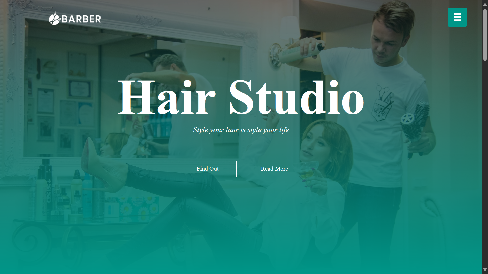
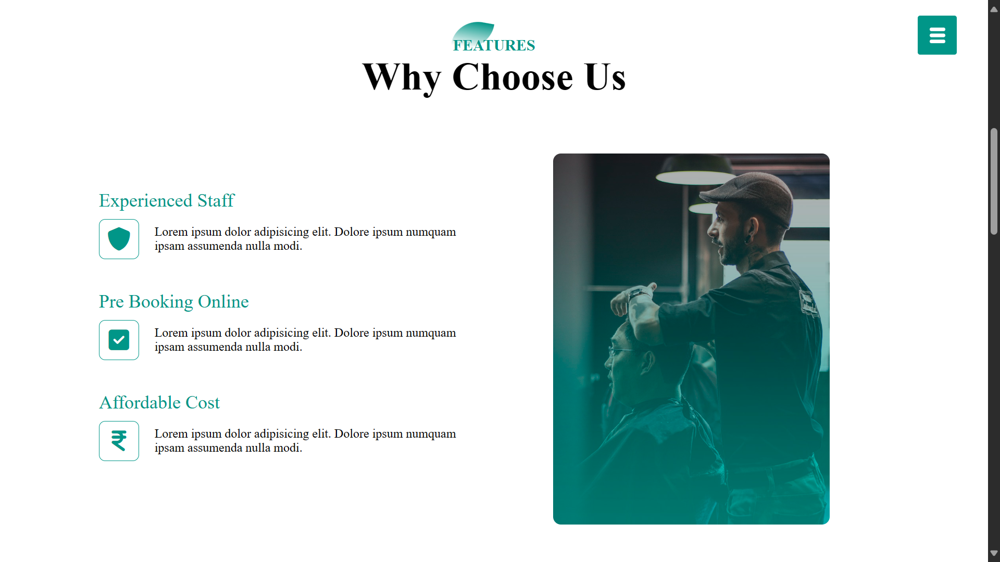
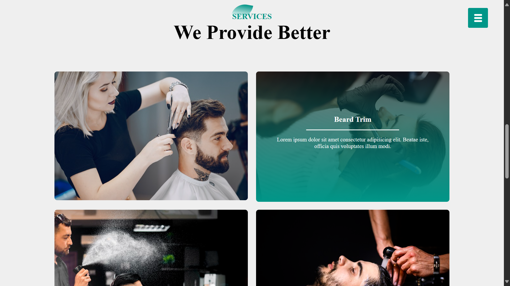
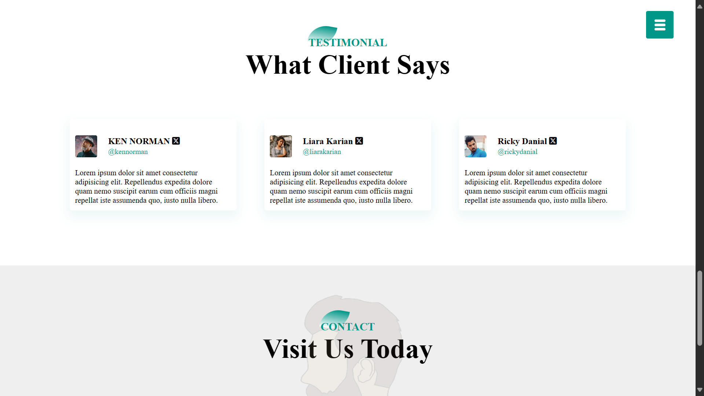

# Barber Shop Website

Welcome to the Barber Shop website project! This project is a simple website designed to showcase the services offered by a barber shop. It can be used as a template or a starting point for similar projects.

## Project Overview
The website contains several sections to give users information about the barber shop, its services, and contact information. It has a clean and straightforward design to make it easy for users to navigate and find the information they need.

## Project URL
To view the live website, click [here](https://barber-hair-saloon.netlify.app/).

## Screenshots
Here are some screenshots of the website:

## Technologies Used
This project is built with the following technologies:
- **HTML**
- **CSS**

## Features
- A landing page with information about the barber shop.
- A section outlining the services offered.
- A contact section with a simple contact form.
- Responsive design to ensure compatibility with different devices.

## Installation and Setup
To run this project locally, follow these steps:

1. Clone the repository: git clone https://github.com/Bilal00404/barber-shop.git
2. Navigate to the project directory: cd Red-Store
3. Open the HTML file in your preferred browser.

## Contact
If you have any questions or suggestions, feel free to contact me at bilalchanna67@gmail.com.